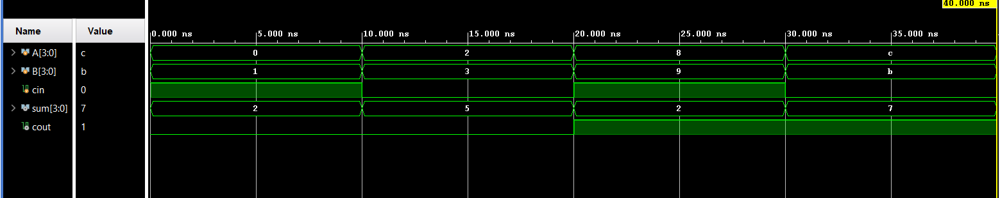
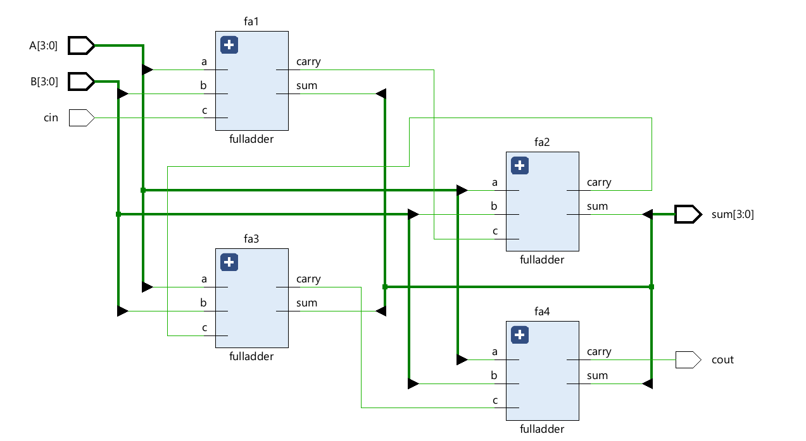

# 4-Bit Ripple Carry Adder (RCA) using Full Adders in Verilog HDL

A 4-Bit Ripple Carry Adder (RCA) is a combinational circuit used to add two 4-bit binary numbers along with an input carry (**Cin**). This design is implemented using four Full Adder modules connected in series, where the carry output of one stage becomes the carry input of the next stage.

---

## Inputs and Outputs

### Inputs

* A[3:0]
* B[3:0]
* Cin

### Outputs

* Sum[3:0]
* Cout

---

## Working Principle

The addition starts from the Least Significant Bit (LSB). Each Full Adder generates a Sum bit and a Carry output. The carry propagates through successive Full Adders until the Most Significant Bit (MSB) is processed, producing the final Carry output (**Cout**).

---

## Project Structure

```text
Ripple_Carry_Adder_4bit/
├── RippleCarryAdder_4bit.v
├── fulladder.v
├── rca_4bit_tb.v
├── Waveform.png
├── Schematic.png
└── README.md
```

---

## Simulation Waveform



---

## Schematic



---

## Tools Used

* Verilog HDL
* Xilinx Vivado
* Vivado Simulator

---

## Key Concepts Demonstrated

* Structural Modeling
* Full Adder Design
* Ripple Carry Propagation
* Combinational Logic Design
* Functional Verification

---

## Author

**Sri Lakshmi Kaathyayani Jonnalagadda** <br>
Final Year B.Tech ECE (VLSI)

*Part of my VLSI Design Learning Journey.*
