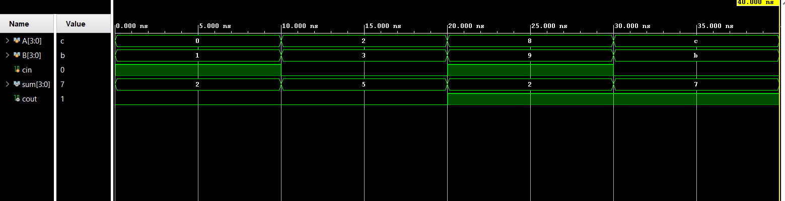
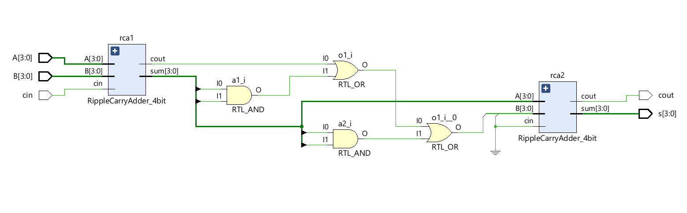

# 4-Bit BCD Adder using Ripple Carry Adder in Verilog HDL

A 4-Bit BCD (Binary Coded Decimal) Adder is a combinational circuit used to add two 4-bit BCD numbers along with an input carry (**Cin**). This design is implemented using Ripple Carry Adders and correction logic to ensure the output remains a valid BCD number (0–9).

If the binary sum exceeds 9 or generates a carry, the circuit adds **6 (0110)** to correct the result into proper BCD format.

---

## Inputs and Outputs

### Inputs
* A[3:0]
* B[3:0]
* Cin

### Outputs
* S[3:0]
* Cout

---

## Working Principle

1. Two 4-bit inputs A and B are added using a Ripple Carry Adder (RCA).
2. The intermediate sum is checked for invalid BCD conditions:
   - Carry generated from first addition
   - (Sum[3] & Sum[2])
   - (Sum[3] & Sum[1])
3. If any condition is true, correction value **0110 (6)** is added using a second RCA.
4. The final output produces a valid BCD digit and carry output.

---

## Project Structure

```text
BCD_Adder_4bit/
├── RippleCarryAdder_4bit.v
├── bcd_adder_4bit.v
├── tb_bcd_adder_4bit.v
├── Waveform.png
├── Schematic.png
└── README.md
```
---

## Simulation Waveform



---

## Schematic



---

## Tools Used

* Verilog HDL
* Xilinx Vivado
* Vivado Simulator

---

## Test Cases Verified

* 3 + 4 = 7
* 5 + 2 = 7
* 7 + 8 = 15 → Corrected to 0001 0101
* 9 + 9 + 1 = 19 → Corrected BCD Output
* 0 + 0 + 1 = 1

---

## Key Concepts Demonstrated

* Structural Modeling using Verilog
* Ripple Carry Adder Design
* BCD Correction Logic
* Combinational Circuit Design
* Hierarchical Module Design
* Functional Verification using Testbench

 
---

## Author

**Sri Lakshmi Kaathyayani Jonnalagadda** <br>
**Final Year B.Tech ECE (VLSI)** <br>
**VIT-AP University**
