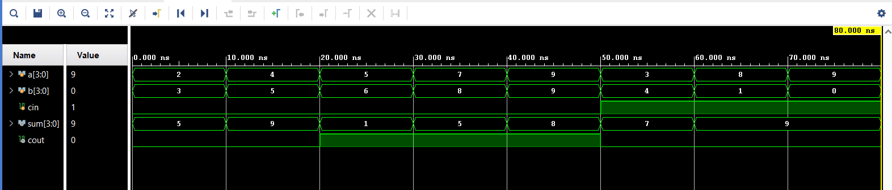
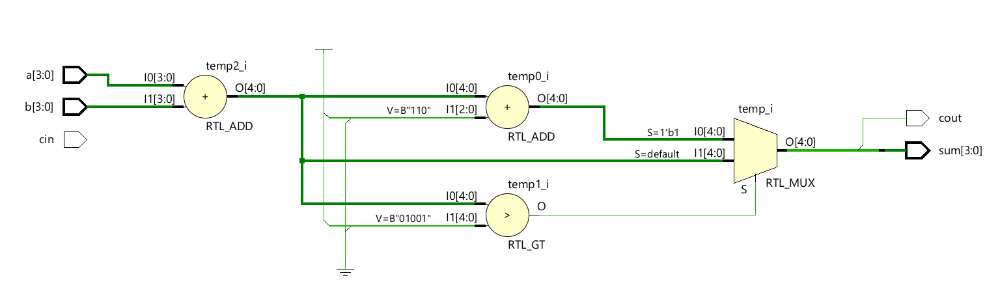

# BCD Adder using Verilog HDL

A BCD (Binary Coded Decimal) Adder is a combinational circuit used to add two BCD digits along with an input carry (**Cin**). If the binary sum exceeds decimal 9, a correction value of **0110 (6)** is added to obtain a valid BCD result. This design is implemented using **Behavioral Modeling** in Verilog HDL.

---

## Inputs and Outputs

### Inputs

* a[3:0]
* b[3:0]
* cin

### Outputs

* sum[3:0]
* cout

---

## Working Principle

The two BCD digits and carry input are added to generate an intermediate binary sum. If the result is greater than decimal 9, the correction value **0110** is added to produce a valid BCD output. The corrected lower four bits form the BCD sum, while the fifth bit is assigned as the carry output (**cout**).

---

## Project Structure

```text
BCD_Adder/
├── bcd_adder.v
├── bcd_adder_tb.v
├── Simualtion_waveform.png
├── Schematic.png
└── README.md
```

---

## Simulation Waveform



---

## Schematic



---

## Tools Used

* Verilog HDL
* Xilinx Vivado
* Vivado Simulator

---

## Modeling Style

* Behavioral Modeling

---

## Key Concepts Demonstrated

* BCD Arithmetic
* BCD Correction Logic
* Behavioral Modeling
* Combinational Logic Design
* Functional Verification

---

## Author

**Sri Lakshmi Kaathyayani Jonnalagadda** <br>
**Final Year B.Tech ECE (VLSI)** <br>
**VIT-AP University**
