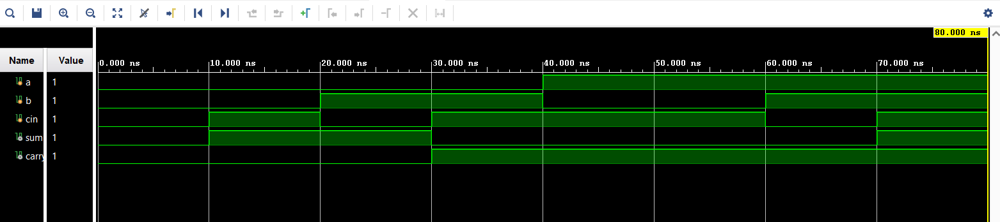
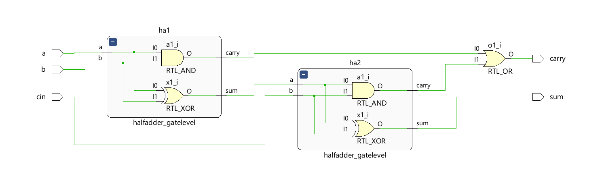

# Full Adder — Structural Modeling using Gate-Level Half Adders in Verilog HDL

A Full Adder is a combinational logic circuit used to add three single-bit binary inputs: **A**, **B**, and **Cin (Carry In)**. It produces two outputs: **Sum** and **Carry**.

This project implements a Full Adder using **Structural Modeling** in Verilog HDL by interconnecting two **gate-level Half Adder modules** and an OR gate. The design demonstrates hierarchical circuit construction, module instantiation, and hardware reusability in digital design.

---

## Truth Table

| A | B | Cin | Sum | Carry |
| - | - | --- | --- | ----- |
| 0 | 0 | 0   | 0   | 0     |
| 0 | 0 | 1   | 1   | 0     |
| 0 | 1 | 0   | 1   | 0     |
| 0 | 1 | 1   | 0   | 1     |
| 1 | 0 | 0   | 1   | 0     |
| 1 | 0 | 1   | 0   | 1     |
| 1 | 1 | 0   | 0   | 1     |
| 1 | 1 | 1   | 1   | 1     |

---

## Logic Equations

**Sum = A ⊕ B ⊕ Cin**

**Carry = (A · B) + (Cin · (A ⊕ B))**

---

## Project Structure

```text
Full_Adder/
├── fa_using_ha.v           ← Full Adder using Half Adders
├── half_adder_gatelevel.v  ← Gate-level Half Adder module
├── full_adder_tb.v         ← Testbench
├── Waveform.png            ← Simulation output
├── Schematic.png           ← Structural schematic
└── README.md
```

---

## Module Hierarchy

```text
Full Adder
│
├── Half Adder 1
│   ├── Inputs : A, B
│   └── Outputs: S1, C1
│
├── Half Adder 2
│   ├── Inputs : S1, Cin
│   └── Outputs: Sum, C2
│
└── OR Gate
    ├── Inputs : C1, C2
    └── Output : Carry
```

---

## Simulation Waveform



---

## Schematic



---

## Tools Used

* Verilog HDL
* Xilinx Vivado
* Vivado Simulator

---

## Key Concepts Demonstrated

* Gate-Level Modeling
* Structural Modeling
* Hierarchical Design
* Module Instantiation
* Combinational Logic Design
* Functional Verification using Testbenches

---

## Author

**Sri Lakshmi Kaathyayani Jonnalagadda** <br>
Final Year B.Tech ECE (VLSI)

*Part of my VLSI Design Learning Journey.*
