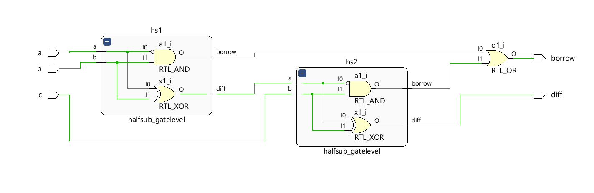

# Full Subtractor — Structural Modeling using Gate-Level Half Subtractors in Verilog HDL

A Full Subtractor is a combinational logic circuit used to subtract two single-bit binary numbers along with a **Borrow In (C)** input. It produces two outputs: **Diff (Difference)** and **Borrow**.

This project implements a Full Subtractor using **Structural Modeling** in Verilog HDL by interconnecting two **gate-level Half Subtractor modules** and an OR gate. The design demonstrates hierarchical circuit construction, module instantiation, and hardware reusability in digital design.

---

## Truth Table

| A | B | C | Diff | Borrow |
| - | - | - | ---- | ------ |
| 0 | 0 | 0 | 0    | 0      |
| 0 | 0 | 1 | 1    | 1      |
| 0 | 1 | 0 | 1    | 1      |
| 0 | 1 | 1 | 0    | 1      |
| 1 | 0 | 0 | 1    | 0      |
| 1 | 0 | 1 | 0    | 0      |
| 1 | 1 | 0 | 0    | 0      |
| 1 | 1 | 1 | 1    | 1      |

---

## Logic Equations

**Diff = A ⊕ B ⊕ C**

**Borrow = A̅B + A̅C + BC**

---

## Project Structure

```text
Full_Subtractor/
├── fs_using_hs.v           ← Full Subtractor using Half Subtractors
├── halfsub_gatelevel.v     ← Gate-level Half Subtractor module
├── full_sub_tb.v            ← Testbench
├── Waveform.png            ← Simulation output
├── Schematic.png           ← Structural schematic
└── README.md
```

---

## Module Hierarchy

```text
Full Subtractor
│
├── Half Subtractor 1
│   ├── Inputs : A, B
│   └── Outputs: D1, B1
│
├── Half Subtractor 2
│   ├── Inputs : D1, C
│   └── Outputs: Diff, B2
│
└── OR Gate
    ├── Inputs : B1, B2
    └── Output : Borrow
```

---

## Simulation Waveform


---

## Schematic



---

## Tools Used

* Verilog HDL
* Xilinx Vivado
* Vivado Simulator

---

## Key Concepts Demonstrated

* Gate-Level Modeling
* Structural Modeling
* Hierarchical Design
* Module Instantiation
* Combinational Logic Design
* Functional Verification using Testbenches

---

## Author

**Sri Lakshmi Kaathyayani Jonnalagadda** <br>
Final Year B.Tech ECE (VLSI)

*Part of my VLSI Design Learning Journey.*
