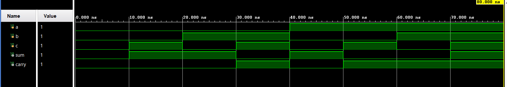
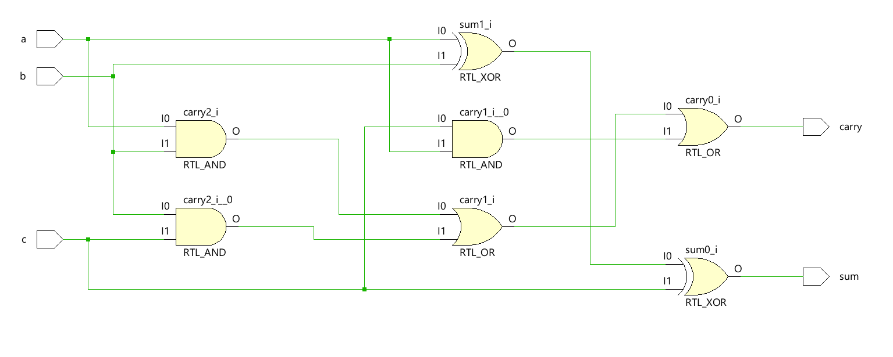

# Full Adder using Behavioral Modeling in Verilog HDL

A Full Adder is a combinational circuit used to add three single-bit binary inputs: two operand bits (**a** and **b**) and a carry input (**c**). It produces a Sum output and a Carry output (**carry**). This design is implemented using **Behavioral Modeling** in Verilog HDL.

---

## Inputs and Outputs

### Inputs

* a
* b
* c

### Outputs

* sum
* carry

---

## Working Principle

The Full Adder performs the addition of two input bits along with an input carry. The **Sum** output represents the least significant bit of the result, while the **Carry** output represents the overflow generated during the addition.

---

## Project Structure

```text
Full_Adder/
├── full_adder.v
├── full_adder_tb.v
├── Simulatin_waveform.png
├── Schematic.png
└── README.md
```

---

## Simulation Waveform



---

## Schematic



---

## Tools Used

* Verilog HDL
* Xilinx Vivado
* Vivado Simulator

---

## Modeling Style

* Behavioral Modeling

---

## Key Concepts Demonstrated

* Binary Addition
* Sum and Carry Generation
* Behavioral Modeling
* Combinational Logic Design
* Functional Verification

---

## Author

**Sri Lakshmi Kaathyayani Jonnalagadda** <br>
**Final Year B.Tech ECE (VLSI)** <br>
**VIT-AP University**
