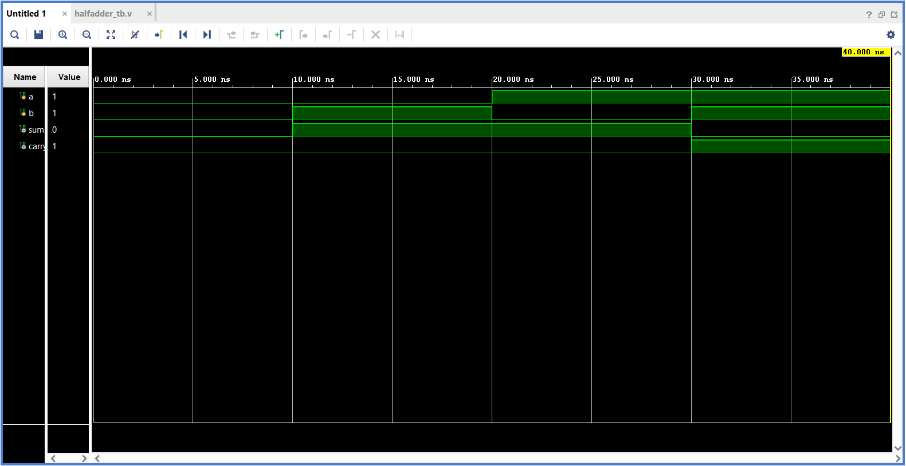
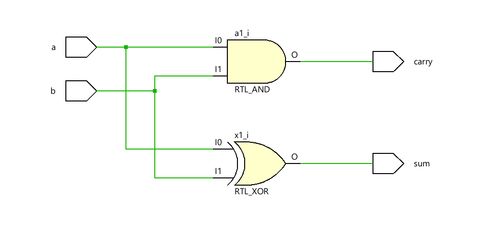

# Half Adder — Gate Level Modeling in Verilog HDL

A Half Adder is one of the most fundamental building blocks in digital design. This project implements it using **Gate-Level Modeling** in Verilog HDL by explicitly instantiating an XOR gate for the Sum output and an AND gate for the Carry output.

---

## Truth Table

| A | B | Sum | Carry |
| - | - | --- | ----- |
| 0 | 0 | 0   | 0     |
| 0 | 1 | 1   | 0     |
| 1 | 0 | 1   | 0     |
| 1 | 1 | 0   | 1     |

**Sum = A ⊕ B**
**Carry = A · B**

---

## Project Structure

```text
Half_Adder/
├── halfadder_gatelevel.v   ← Gate-level RTL design
├── halfadder_tb.v          ← Testbench
├── Waveform.png            ← Simulation output
├── Schematic.png           ← Gate-level schematic
└── README.md
```

---

## Simulation Waveform



---

## Schematic



---

## Tools Used

* Verilog HDL
* Xilinx Vivado
* Vivado Simulator

---

## Author

**Sri Lakshmi Kaathyayani Jonnalagadda**
<br>
B.Tech in ECE(VLSI)

*Part of my VLSI Design Learning Journey.*
