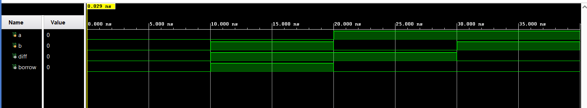
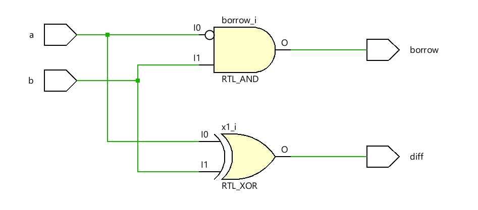

# Half Subtractor — Gate Level Modeling in Verilog HDL

A Half Subtractor is a basic combinational logic circuit used to subtract one single-bit binary number from another. This project implements a Half Subtractor using **Gate-Level Modeling** in Verilog HDL by explicitly instantiating XOR, NOT, and AND gates to generate the Difference and Borrow outputs.

---

## Truth Table

| A | B | Difference | Borrow |
| - | - | ---------- | ------ |
| 0 | 0 | 0          | 0      |
| 0 | 1 | 1          | 1      |
| 1 | 0 | 1          | 0      |
| 1 | 1 | 0          | 0      |

**Difference = A ⊕ B**
**Borrow = A̅ · B**

---

## Project Structure

```text
Half_Subtractor/
├── halfsub_gatelevel.v     ← Gate-level RTL design
├── halfsub_tb.v            ← Testbench
├── Waveform.png            ← Simulation output
├── Schematic.png           ← Gate-level schematic
└── README.md
```

---

## Simulation Waveform



---

## Schematic



---

## Tools Used

* Verilog HDL
* Xilinx Vivado
* Vivado Simulator

---

## Author

**Sri Lakshmi Kaathyayani Jonnalagadda** <br>
**Final Year B.Tech ECE (VLSI)** <br>
**VIT-AP University**
