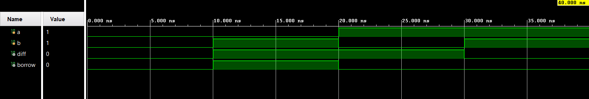
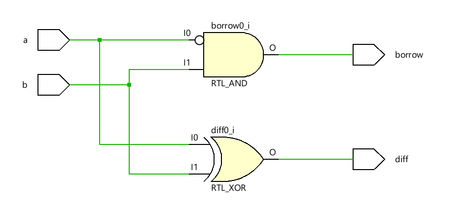

# Half Subtractor using Behavioral Modeling in Verilog HDL

A Half Subtractor is a combinational circuit used to subtract one single-bit binary number (**b**) from another (**a**). It produces a Difference output (**diff**) and a Borrow output (**borrow**). This design is implemented using **Behavioral Modeling** in Verilog HDL.

---

## Inputs and Outputs

### Inputs

* a
* b

### Outputs

* diff
* borrow

---

## Working Principle

The Half Subtractor performs the subtraction of two single-bit inputs. The **diff** output represents the result of the subtraction, while the **borrow** output indicates whether a borrow is required from the next higher bit position.

---

## Project Structure

```text
Half_Subtractor/
├── half_sub.v
├── half_sub_tb.v
├── Simulation_waveform.png
├── Schematic.png
└── README.md
```

---

## Simulation Waveform



---

## Schematic



---

## Tools Used

* Verilog HDL
* Xilinx Vivado
* Vivado Simulator

---

## Modeling Style

* Behavioral Modeling

---

## Key Concepts Demonstrated

* Binary Subtraction
* Difference and Borrow Generation
* Behavioral Modeling
* Combinational Logic Design
* Functional Verification

---

## Author

**Sri Lakshmi Kaathyayani Jonnalagadda** <br>
**Final Year B.Tech ECE (VLSI)** <br>
**VIT-AP University**
